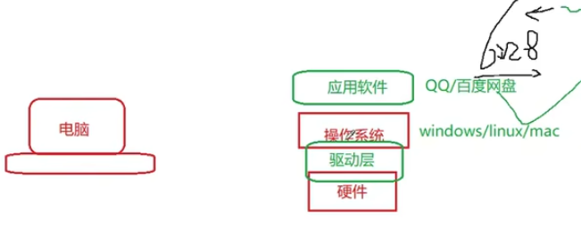

# 0.1 什么是 c 语言

我就想看看重新学习 c 语言，到底需要多长时间，才可以学完。

这是一个最好的时代，又是一个最坏的时代。好在足不出户就能看到网上各种教程。

我也找了很多教程，还是感觉这个可能更简单些。 先看一遍视频，然后再去看 ansi c

以下是正文，算是一个尝试，去记录自己学习的过程。

可以用来编写底层的东西吧，这里有一个举例。 使用电脑的时候，用的更多的是 os 之上的应用软件，而不是操作系统，驱动层这样。

<figure><figcaption></figcaption></figure>

语言刚开始设计出来，不是说一步到位的，肯定有一个发展的过程。如如何保证“通用、统一”，就有了 ANSI C， C89 版本是一个很重要的版本。 这就是标准的重要性。
